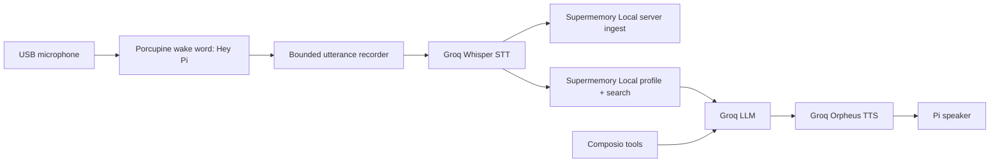

# Architecture

## Data Flow

1. The Pi listens locally for `Hey Pi`.
2. After wake-word detection, it records a short utterance.
3. Groq Whisper transcribes the utterance.
4. The exact transcript is written into the local Supermemory server under a container tag.
5. The same transcript is used as the recall query against the local Supermemory profile/search endpoint.
6. Groq generates a short spoken answer using the retrieved memory context.
7. Optional Composio tools are available for actions such as calendar, email, GitHub, or home automation.
8. Groq Orpheus renders the answer as speech.

## Design Choices

- Wake word stays offline for privacy and low latency.
- Memory stays local through Supermemory Local.
- The hosted Supermemory API is not used.
- Free-tier external inference is isolated behind Groq.
- Composio is optional and only initialized when configured.
- Hardware deployment is handled by a user-level systemd service.
